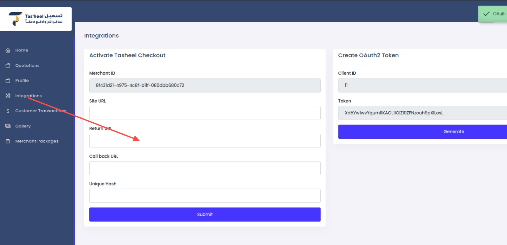

# Tasheel Travel Now Pay Later - Merchant API Integration Guide

## 1. Overview
Tasheel BNPL API enables merchants to create invoices for customers who want to travel now and pay later. Customers can view invoices in the Tasheel app and pay the downpayment. Merchants can:
- Check customer eligibility and payment plan.
- Create invoice (cart) if eligible.
- Authenticate to get JWT token.
- Check payment status after downpayment.

---

## 2. Authentication & Authorization
Merchants authenticate using OAuth flow.

### 2.1 Create OAuth Client
```
POST /createOauthClient
```
**Body:**
```json
{
  "name": "MerchantApp",
  "redirect": "https://merchant.com/callback",
  "grant_type": "client_credentials"
}
```
**Response:**
```json
{
  "client_id": 123,
  "client_secret": "abc123xyz",
  "name": "MerchantApp",
  "redirect": "https://merchant.com/callback",
  "grant_type": "client_credentials"
}
```

### 2.2 Issue Access Token
```
POST /oauth/token
```
**Body:**
```json
{
  "client_id": 123,
  "client_secret": "abc123xyz"
}
```
**Response:**
```json
{
  "access_token": "jwt-token",
  "token_type": "Bearer",
  "expires_at": "2025-12-01T12:00:00Z"
}
```
Use `Authorization: Bearer <jwt-token>` for all subsequent requests.

---

## 3. Base URL & Environment
- Sandbox: `https://sandbox.tasheelbnpl.com/api`
- Production: `https://api.tasheelbnpl.com`

---

## 4. Rate Limits
- `/oauth/token`: 30 requests/minute
- `/checkout/summery`: 20 requests/minute
- `/checkout/status`: 25 requests/minute

---

## 5. Idempotency
Tasheel uses `referenceCode` in the request body for idempotency. Merchants must concatenate their `merchantId` and `merchantOrderId`:
```
"referenceCode": "tasheel123-ORD98765"
```
If the same referenceCode is sent again, Tasheel will return the existing cart instead of creating a new one.

---

## 6. Endpoints

### 6.1 Get Summary
```
POST /checkout/summery
```
**Body:**
```json
{
  "merchantId": "tasheel123",
  "customerPhone": "96891234567",
  "cartItems": [
    {"productId": "FLIGHT001", "quantity": 1, "price": 150, "total": 150}
  ],
  "totalAmount": 150
}
```
**Response:**
```json

{
  "message": "Cart summary",
  "cart": {
    "base_amount": 150.00,
    "total_amount_without_vat": 150.00,
    "total_amount_with_vat": 157.50,
    "shortage": 0.00,
    "per_installment": 50.00,
    "down_payment_without_vat": 50.00,
    "down_payment_with_vat": 52.50,
    "remaining_after_down_payment": 105.00,
    "per_installment_with_vat": 52.50,
    "used_eligibility": 150.00,
    "eligibility": 500.00,
    "is_eligible": true,
    "plan_html": "<div>Installment Plan HTML</div>",
    "json_rates": {
      "vat_rate": 5,
      "pg_rate": 2,
      "merchant_rate": 1,
      "tasheel_profit_rate": 3
    },
    "customer_rate": 1.5,
    "vat_rate": 5,
    "pg_rate": 2,
    "merchant_rate": 1,
    "tasheel_profit_rate": 3,
    "tasheel_price_without_vat": 150.00,
    "tasheel_vat_amount": 7.50,
    "monthly_installments": [
      {"amount": 52.50, "due_date": "2025-12-01"},
      {"amount": 52.50, "due_date": "2026-01-01"}
    ],
    "user_eligibility_data": {
      "credit_score": 720,
      "max_limit": 1000.00
    }
  }
}

```

### 6.2 Create Cart
```
POST /checkout/cart
```
**Body:**
```json
{
  "merchantId": "tasheel123",
  "customerPhone": "96891234567",
  "customerEmail": "customer@example.com",
  "quotationType": "refundable", // Specifies the type of quotation. Use "refundable" if the quotation allows refunds, or "non-refundable" if refunds are not permitted.
  "cartItems": [
    {"productId": "FLIGHT001", "quantity": 1, "price": 150, "total": 150}
  ],
  "totalAmount": 150,
  "referenceCode": "tasheel123-ORD98765",
  "cartValidity": "02:00", // Maximum time the user can confirm and pay the downpayment. Minimum is "00:01" (1 minute) and maximum is "48:00" (2 days).
  "callback_url": "https://merchant.com/webhook"
}
```
**Response:**
```json
{
  "message": "Cart created successfully",
  "cart_id": "UUID123",
  "ref_code": "tasheel123-ORD98765",
  "otp_expire_at": "2025-11-25T12:10:00Z",
  "cart_expire_at": "2025-11-25T14:10:00Z",
  "redirect_url": "https://tasheelbnpl.com/pay/UUID123"
}
```

### 6.3 Get Status
```
GET /checkout/status?cartId=UUID123
```
**Response:**
```json
{
  "message": "Cart status",
  "data": {
    "uuid": "UUID123",
    "referenceCode": "tasheel123-ORD98765",
    "payment": {
      "txn_id": "TXN123456",
      "created_at": "2025-11-25T10:30:00Z",
      "try": 1,
      "status": "completed", // Status options: 1 => "completed", 2 => "pending", 3 => "cancel", default => "unknown".
      "note": "Downpayment received",
      "amount": 50.00,
      "final_amount": 50.00,
      "currency": "OMR",
      "ref_code": "tasheel123-ORD98765"
    },
    "quotation": {
      "title": "Cart for John Doe",
      "description": "Travel package",
      "package": {
        "name": "Holiday Package",
        "details": "Includes flight and hotel"
      },
      "plan": {
        "installments": [
          {"amount": 50, "due_date": "2025-12-01"},
          {"amount": 50, "due_date": "2026-01-01"}
        ]
      },
      "base_amount": 150.00,
      "total_amount": 150.00,
      "vat_rate": 5,
      "currency": "OMR",
      "quotationNumber": "QTN98765"
    },
    "user": {
      "uuid": "USR123",
      "branch": {"name": "Main Branch"},
      "branchStaff": {"name": "Staff Name"},
      "accountNumber": "ACC12345",
      "firstName": "John",
      "lastName": "Doe",
      "username": "johndoe",
      "email": "john@example.com",
      "countryCode": "+968",
      "mobile": "91234567",
      "balance": 500.00,
      "image": "https://cdn.tasheel.com/user123.jpg",
      "address": "Muscat, Oman",
      "status": "active",
      "isCompany": false,
      "malaaCreditScore": 720
    },
    "requestData": {
      "merchantId": "tasheel123",
      "customerPhone": "96891234567",
      "cartItems": [
        {"productId": "FLIGHT001", "quantity": 1, "price": 150, "total": 150}
      ],
      "totalAmount": 150,
      "referenceCode": "tasheel123-ORD98765"
    }
  }
}
```

### 6.4 Delete Cart
```
DELETE /checkout/cart?cartId=UUID123
```
**Response:**
```json
{
  "message": "Cart deleted successfully"
}
```

---

## 7. Webhooks
Merchant sets `callback_url` in Create Cart request. Tasheel sends POST:
```json
{
  "txnId": "TXN123456",
  "status": true
}
```
Merchant then calls Get Status API.

---

## 8. Laravel Middleware Notes
- `auth:passport` for merchant routes
- `auth:api_branch_staff` for status/delete
- Throttle limits applied per route

---

## 9. Versioning, Timeouts & Retries
- Versioning: `/`
- Timeout: 30s
- Retry: Exponential backoff for transient errors

---

### 10. Setting Redirect URL After Successful Payment

To set the redirect URL after a successful payment, follow these steps:

1. Navigate to the Merchant Dashboard.
2. Locate the "Integration Settings" section.
3. Set the "Redirect URL" field to the desired URL where customers will be redirected after a successful payment.

Below is a screenshot from the Merchant Dashboard for reference:



Ensure that the URL is accessible and properly handles the response from the payment gateway.

