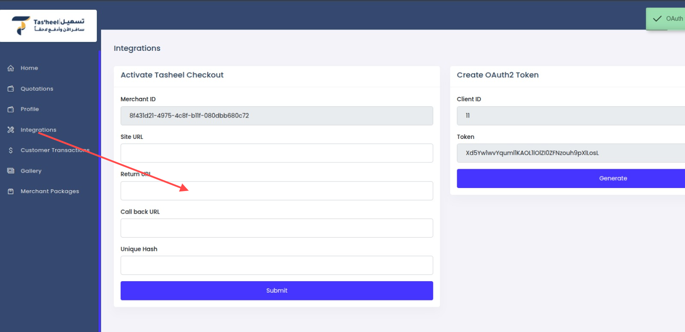

# Tasheel Travel Now Pay Later - Merchant API Integration Guide

## 1. Overview
Tasheel BNPL API enables merchants to create invoices for customers who want to travel now and pay later. Customers can view invoices in the Tasheel app and pay the downpayment. Merchants can:
- Check customer eligibility and payment plan.
- Create invoice (cart) if eligible.
- Authenticate to get JWT token.
- Check payment status after downpayment.

---

## 2. Authentication & Authorization
Merchants authenticate using OAuth flow.

### 2.1 Create OAuth Client
```
POST /createOauthClient
```
**Body:**
```json
{
  "name": "MerchantApp",
  "redirect": "https://merchant.com/callback",
  "grant_type": "client_credentials"
}
```
**Response:**
```json
{
  "client_id": 123,
  "client_secret": "abc123xyz",
  "name": "MerchantApp",
  "redirect": "https://merchant.com/callback",
  "grant_type": "client_credentials"
}
```

### 2.2 Issue Access Token
```
POST /oauth/token
```
**Body:**
```json
{
  "client_id": 123,
  "client_secret": "abc123xyz"
}
```
**Response:**
```json
{
  "access_token": "jwt-token",
  "token_type": "Bearer",
  "expires_at": "2025-12-01T12:00:00Z"
}
```
Use `Authorization: Bearer <jwt-token>` for all subsequent requests.

---

## 3. Base URL & Environment
- Sandbox: `https://sandbox.tasheelbnpl.com/api`
- Production: `https://api.tasheelbnpl.com`

---

## 4. Rate Limits
- `/oauth/token`: 30 requests/minute
- `/checkout/summery`: 20 requests/minute
- `/checkout/status`: 25 requests/minute

---

## 5. Idempotency
Tasheel uses `referenceCode` in the request body for idempotency. Merchants must concatenate their `merchantId` and `merchantOrderId`:
```
"referenceCode": "tasheel123-ORD98765"
```
If the same referenceCode is sent again, Tasheel will return the existing cart instead of creating a new one.

---

## 6. Endpoints

### 6.1 Get Summary
```
POST /checkout/summery
```
**Body:**
```json
{
  "merchantId": "tasheel123",
  "customerPhone": "96891234567",
  "cartItems": [
    {"productId": "FLIGHT001", "quantity": 1, "price": 150, "total": 150}
  ],
  "totalAmount": 150
}
```
**Response:**
```json

{
  "message": "Cart summary",
  "cart": {
    "base_amount": 150.00,
    "total_amount_without_vat": 150.00,
    "total_amount_with_vat": 157.50,
    "shortage": 0.00,
    "per_installment": 50.00,
    "down_payment_without_vat": 50.00,
    "down_payment_with_vat": 52.50,
    "remaining_after_down_payment": 105.00,
    "per_installment_with_vat": 52.50,
    "used_eligibility": 150.00,
    "eligibility": 500.00,
    "is_eligible": true,
    "plan_html": "<div>Installment Plan HTML</div>",
    "json_rates": {
      "vat_rate": 5,
      "pg_rate": 2,
      "merchant_rate": 1,
      "tasheel_profit_rate": 3
    },
    "customer_rate": 1.5,
    "vat_rate": 5,
    "pg_rate": 2,
    "merchant_rate": 1,
    "tasheel_profit_rate": 3,
    "tasheel_price_without_vat": 150.00,
    "tasheel_vat_amount": 7.50,
    "monthly_installments": [
      {"amount": 52.50, "due_date": "2025-12-01"},
      {"amount": 52.50, "due_date": "2026-01-01"}
    ],
    "user_eligibility_data": {
      "credit_score": 720,
      "max_limit": 1000.00
    }
  },
  "merchant_credit_utilisation": {
    "eligible_limit": 10000,
    "current_eligible": 10000,
    "utilised": 0
  }
}

```

**Expected Error Response (403 - User Overdue / Not Eligible):**
```json
{
  "status": "error",
  "code": "LOAN_NOT_ELIGIBLE_OVERDUE",
  "message": "User is not eligible for a new loan due to overdue installments."
}
```

### 6.2 Create Cart
```
POST /checkout/cart
```
**Body Parameters:**
- `merchantId` (required): A string representing the merchant ID. Must exist in the `branch_staff` table.
- `customerPhone` (required): A string representing the customer's phone number. Maximum length is 15 characters.
- `customerEmail` (optional): A string representing the customer's email address. Must be a valid email format and have a maximum length of 255 characters.
- `quotationType` (optional): A string specifying the type of quotation. Allowed values are `refundable` and `non_refundable`.
- `cartItems` (required): An array of cart items. Each item must include:
  - `productId` (required): A string representing the product ID.
  - `quantity` (required): An integer representing the quantity. Minimum value is 1.
  - `price` (required): A numeric value representing the price. Minimum value is 0.
  - `total` (required): A numeric value representing the total price. Minimum value is 0.
  - `description` (optional): A string describing the product. Maximum length is 255 characters.
- `totalAmount` (required): A numeric value representing the total amount. Minimum value is 0.
- `referenceCode` (optional): A string representing the reference code. Maximum length is 255 characters.
- `cartValidity` (optional): A string representing the cart validity in `HH:mm` format.

**Sample Request:**
```json
{
  "merchantId": "tasheel123",
  "customerPhone": "96891234567",
  "customerEmail": "customer@example.com",
  "quotationType": "refundable", // Specifies the type of quotation. Use "refundable" if the quotation allows refunds, or "non-refundable" if refunds are not permitted.
  "cartItems": [
    {"productId": "FLIGHT001", "quantity": 1, "price": 150, "total": 150}
  ],
  "totalAmount": 150,
  "referenceCode": "tasheel123-ORD98765",
  "cartValidity": "02:00", // Maximum time the user can confirm and pay the downpayment. Minimum is "00:01" (1 minute) and maximum is "48:00" (2 days).
  "callback_url": "https://merchant.com/webhook"
}
```
**Response:**
```json
{
  "message": "Cart created successfully",
  "cart_id": "UUID123",
  "ref_code": "tasheel123-ORD98765",
  "otp_expire_at": "2025-11-25T12:10:00Z",
  "cart_expire_at": "2025-11-25T14:10:00Z",
  "redirect_url": "https://tasheelbnpl.com/pay/UUID123"
}
```

**Expected Error Response (422 - Invalid `cartValidity` format):**
```json
{
  "error": {
    "cartValidity": [
      "The cart validity format is invalid."
    ]
  }
}
```

### 6.3 Get Status
```
GET /checkout/status
```
**Body Parameters:**
- `refCode` (optional): Merchant reference code used for idempotency. It equals `merchantId` concatenated with the merchant’s order number (e.g., `tasheel123-ORD98765`). Must exist in `tasheel_payment_links` table.
- `cartId` (optional): The cart UUID returned from Create Cart (e.g., `cart_id`). Must exist in `tasheel_payment_links` table.
- `txnId` (optional): Transaction ID provided by Tasheel in the webhook request to your `callback_url` when Tasheel calls the merchant’s callback. Use if `refCode` or `cartId` is unavailable. Must exist in `payments` table.

**Response:**
```json
{
  "message": "Cart status",
  "data": {
    "uuid": "UUID123",
    "referenceCode": "tasheel123-ORD98765",
    "payment": {
      "txn_id": "TXN123456",
      "created_at": "2025-11-25T10:30:00Z",
      "try": 1,
      "status": "completed", // Status options: 1 => "completed", 2 => "pending", 3 => "cancel", default => "unknown".
      "note": "Downpayment received",
      "amount": 50.00,
      "final_amount": 50.00,
      "currency": "OMR",
      "ref_code": "tasheel123-ORD98765"
    },
    "quotation": {
      "title": "Cart for John Doe",
      "description": "Travel package",
      "package": {
        "name": "Holiday Package",
        "details": "Includes flight and hotel"
      },
      "plan": {
        "installments": [
          {"amount": 50, "due_date": "2025-12-01"},
          {"amount": 50, "due_date": "2026-01-01"}
        ]
      },
      "base_amount": 150.00,
      "total_amount": 150.00,
      "vat_rate": 5,
      "currency": "OMR",
      "quotationNumber": "QTN98765"
    },
    "user": {
      "uuid": "USR123",
      "branch": {"name": "Main Branch"},
      "branchStaff": {"name": "Staff Name"},
      "accountNumber": "ACC12345",
      "firstName": "John",
      "lastName": "Doe",
      "username": "johndoe",
      "email": "john@example.com",
      "countryCode": "+968",
      "mobile": "91234567",
      "balance": 500.00,
      "image": "https://cdn.tasheel.com/user123.jpg",
      "address": "Muscat, Oman",
      "status": "active",
      "isCompany": false,
      "malaaCreditScore": 720
    },
    "requestData": {
      "merchantId": "tasheel123",
      "customerPhone": "96891234567",
      "cartItems": [
        {"productId": "FLIGHT001", "quantity": 1, "price": 150, "total": 150}
      ],
      "totalAmount": 150,
      "referenceCode": "tasheel123-ORD98765"
    }
  }
}
```

#### Status interpretation for payment.status
- completed: Downpayment paid successfully
- pending: Payment initialized but still pending
- cancel: Payment rejected or declined
- unknown: Treated as cancel

### 6.4 Delete Cart
```
DELETE /checkout/cart
```
**Body Parameters:**
- `refCode` (optional): Merchant reference code used for idempotency. It equals `merchantId` concatenated with the merchant’s order number (e.g., `tasheel123-ORD98765`). Must exist in `tasheel_payment_links` table.
- `cartId` (optional): The cart UUID returned from Create Cart (e.g., `cart_id`). Must exist in `tasheel_payment_links` table.
- `txnId` (optional): Transaction ID provided by Tasheel in the webhook request to your `callback_url` when Tasheel calls the merchant’s callback. Use if `refCode` or `cartId` is unavailable. Must exist in `payments` table.

**Response:**
```json
{
  "message": "Cart deleted successfully"
}
```

---

## 7. Webhooks
Merchant sets `callback_url` in Create Cart request. Tasheel sends POST:
```json
{
  "txnId": "TXN123456",
  "status": true
}
```
Merchant then calls Get Status API.

---

## 8. Laravel Middleware Notes
- `auth:passport` for merchant routes
- `auth:api_branch_staff` for status/delete
- Throttle limits applied per route

---

## 9. Versioning, Timeouts & Retries
- Versioning: `/`
- Timeout: 30s
- Retry: Exponential backoff for transient errors

---

### 10. Setting Redirect URL After Successful Payment

To set the redirect URL after a successful payment, follow these steps:

1. Navigate to the Merchant Dashboard.
2. Locate the "Integration Settings" section.
3. Set the "Redirect URL" field to the desired URL where customers will be redirected after a successful payment.

Below is a screenshot from the Merchant Dashboard for reference:



Ensure that the URL is accessible and properly handles the response from the payment gateway.

---

## 11. Merchant Refund APIs


### 11.1 Base URL

- Prefix: `/api`
- Refund routes prefix: `/refund`
- Full base path for this module: `/api/refund`

### 11.2 Authentication and Authorization


Use the same JWT access token generated in `2.2 Issue Access Token`.

Expected headers:

```http
Authorization: Bearer <access_token>
Accept: application/json
Content-Type: application/json
```

### 11.3 Endpoints

#### 11.3.1 Calculate Refund Summary

- Method: `POST`
- URL: `/api/refund/request`

Request body:

```json
{
  "tasheel_order_uuid": "07da47f6-ddd7-4672-812e-26f68f83f860",
  "airline_refund_amount": 70,
  "currency": "OMR"
}
```

Validation rules:

- `tasheel_order_uuid`: required, string, max length `36` (Payment Link UUID)
- `airline_refund_amount`: required, numeric, min `0`, must be less than or equal to backend-calculated ticket amount
- `currency`: required, string, max length `10`

Success response (`200`):

```json
{
  "remark": "refund_summary",
  "status": "success",
  "data": {
    "summary": {
      "total_amount": 300,
      "refund_amount": 70,
      "paid_amount": 106.5,
      "paid_ticket_amount": 75,
      "ticket_refund_on_paid_portion": 70,
      "total_remaining": 225,
      "service_fee_total": 30,
      "vat_total": 1.5,
      "captured_service_fees_with_vat": 31.5,
      "service_fees_collection_mode": "DOWNPAYMENT_ONLY",
      "is_downpayment_paid": true,
      "shortage_on_refund": 155,
      "refund_effect_on_next_installments": {
        "shortage_before_capture": 155,
        "captured_from_next_installments": 155,
        "shortage_after_capture": 0,
        "installments_to_cancel_count": 0
      },
      "next_installments": [
        {
          "id": 1026,
          "amount": 75,
          "installment_date": "2026-05-09",
          "is_downpayment": false,
          "capture_amount": 75,
          "cancel_amount": 0,
          "action": "capture_then_cancel"
        },
        {
          "id": 1027,
          "amount": 75,
          "installment_date": "2026-06-08",
          "is_downpayment": false,
          "capture_amount": 75,
          "cancel_amount": 0,
          "action": "capture_then_cancel"
        },
        {
          "id": 1028,
          "amount": 75,
          "installment_date": "2026-07-08",
          "is_downpayment": false,
          "capture_amount": 5,
          "cancel_amount": 70,
          "action": "capture_then_cancel"
        }
      ]
    }
  }
}
```

Error responses:

- `422` validation error

```json
{
  "remark": "validation_error",
  "status": "error",
  "message": {
    "error": [
      "The tasheel order uuid field is required."
    ]
  }
}
```

- `404` tasheel order uuid not found

```json
{
  "remark": "cart_not_found",
  "status": "error",
  "message": {
    "error": [
      "Payment cart not found for this tasheel order uuid"
    ]
  }
}
```

- `403` unauthorized access to tasheel order uuid

```json
{
  "remark": "merchant_unauthorized",
  "status": "error",
  "message": {
    "error": [
      "You are not authorized to access this tasheel order uuid"
    ]
  }
}
```
#### 11.3.2 Create Refund Request
- Method: `POST`
- URL: `/api/refund/request`

Notes:

- This endpoint creates a refund request and immediately attempts auto-approval through the refund approval service.

Request body:

```json
{
  "tasheel_order_uuid": "07da47f6-ddd7-4672-812e-26f68f83f860",
  "airline_refund_amount": 70,
  "currency": "OMR",
  "callback_url": "https://merchant.example.com/refunds/callback"
}
```

Validation rules:

- `tasheel_order_uuid`: required, string, max length `36` (Payment Link UUID)
- `airline_refund_amount`: required, numeric, min `0`, must be less than or equal to backend-calculated ticket amount
- `currency`: required, string, max length `10`
- `callback_url`: optional, valid URL, max length `1000`

Success response (`200`):

```json
{
  "tasheel_order_uuid": "07da47f6-ddd7-4672-812e-26f68f83f860",
  "total_amount": 300,
  "refund_amount": 70,
  "paid_amount": 106.5,
  "paid_ticket_amount": 75,
  "service_fee_total": 30,
  "vat_total": 1.5,
  "captured_service_fees": 31.5,
  "shortage_on_refund": 155,
  "next_installments": [
    {
      "id": 966,
      "amount": 75,
      "installment_date": "2026-05-05",
      "is_downpayment": false,
      "capture_amount": 75,
      "cancel_amount": 0,
      "action": "capture_then_cancel"
    },
    {
      "id": 967,
      "amount": 75,
      "installment_date": "2026-06-04",
      "is_downpayment": false,
      "capture_amount": 75,
      "cancel_amount": 0,
      "action": "capture_then_cancel"
    },
    {
      "id": 968,
      "amount": 75,
      "installment_date": "2026-07-04",
      "is_downpayment": false,
      "capture_amount": 5,
      "cancel_amount": 70,
      "action": "capture_then_cancel"
    }
  ]
}
```

Error responses:

- `422` validation error

```json
{
  "remark": "validation_error",
  "status": "error",
  "message": {
    "error": [
      "The tasheel order uuid field is required."
    ]
  }
}
```
- `404` tasheel order uuid not found

```json
{
  "remark": "cart_not_found",
  "status": "error",
  "message": {
    "error": [
      "Payment cart not found for this tasheel order uuid"
    ]
  }
}
```

- `403` unauthorized access to tasheel order uuid

```json
{
  "remark": "merchant_unauthorized",
  "status": "error",
  "message": {
    "error": [
      "You are not authorized to access this tasheel order uuid"
    ]
  }
}
```
#### 11.3.2 List Refund Requests

- Method: `GET`
- URL: `/api/refund/`

Notes:

- Returns refunds for the authenticated merchant.
- Results are paginated (`15` per page).

Success response (`200`):

```json
{
  "remark": "refunds_list",
  "status": "success",
  "data": [
    {
      "id": 1,
      "tasheel_order_uuid": "c5ea8070-5f67-4f7f-8fe0-3d95ff2d95e5",
      "merchant_id": "123",
      "ticket_amount": 120.5,
      "airline_refund_amount": 100,
      "currency": "OMR",
      "callback_url": "https://merchant.example.com/refunds/callback",
      "status": 0,
      "status_label": "<span class=\"badge badge--warning\">Pending</span>",
      "admin_feedback": null,
      "calculation_summary": {},
      "approved_refund_amount": null,
      "approved_at": null,
      "created_at": "2026-03-11 09:30:00",
      "updated_at": "2026-03-11 09:30:00",
      "payments": []
    }
  ],
  "meta": {
    "current_page": 1,
    "last_page": 1,
    "per_page": 15,
    "total": 1
  }
}
```

#### 11.3.3 Get Refund Request Details

- Method: `GET`
- URL: `/api/refund/{id}`

Path parameters:

- `id`: refund request ID

Success response (`200`):

```json
{
  "remark": "refund_details",
  "status": "success",
  "data": {
    "refund": {
      "id": 1,
      "tasheel_order_uuid": "c5ea8070-5f67-4f7f-8fe0-3d95ff2d95e5",
      "merchant_id": "123",
      "ticket_amount": 120.5,
      "airline_refund_amount": 100,
      "currency": "OMR",
      "callback_url": "https://merchant.example.com/refunds/callback",
      "status": 0,
      "status_label": "<span class=\"badge badge--warning\">Pending</span>",
      "payments": []
    },
    "total_paid": 60.25,
    "total_pending": 60.25,
    "total_cancelled": 0,
    "loans": []
  }
}
```

Error responses:

- `404` if refund request is not found (`findOrFail`)

### 11.4 Quick cURL Examples

```bash
curl -X POST "https://<host>/api/refund/calculate-summary" \
  -H "Authorization: Bearer <token>" \
  -H "Accept: application/json" \
  -H "Content-Type: application/json" \
  -d '{
    "tasheel_order_uuid": "07da47f6-ddd7-4672-812e-26f68f83f860",
    "airline_refund_amount": 70,
    "currency": "OMR"
  }'

curl -X POST "https://<host>/api/refund/request" \
  -H "Authorization: Bearer <token>" \
  -H "Accept: application/json" \
  -H "Content-Type: application/json" \
  -d '{
    "tasheel_order_uuid": "07da47f6-ddd7-4672-812e-26f68f83f860",
    "airline_refund_amount": 70,
    "currency": "OMR",
    "callback_url": "https://merchant.example.com/refunds/callback"
  }'

curl -X GET "https://<host>/api/refund/" \
  -H "Authorization: Bearer <token>" \
  -H "Accept: application/json"

curl -X GET "https://<host>/api/refund/1" \
  -H "Authorization: Bearer <token>" \
  -H "Accept: application/json"
```

### 11.5 Callback Payload Example

When admin approves or rejects a request and `callback_url` exists, a `POST` request is sent:

```json
{
  "refund_request_id": 45,
  "tasheel_order_uuid": "c5ea8070-5f67-4f7f-8fe0-3d95ff2d95e5",
  "merchant_id": "123",
  "status": 1,
  "status_text": "approved",
  "approved_refund_amount": 60.25,
  "airline_refund_amount": 100,
  "currency": "OMR",
  "admin_note": "Approved after review",
  "approved_at": "2026-03-11 10:20:00",
  "updated_at": "2026-03-11 10:20:00"
}
```

